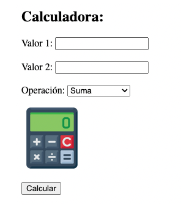

# UT2-TE1
# IMPLANTACIÓN DE ARQUITECTURAS WEB
## Jesus Sosa Morales
En este informe se tratara la Instalacion de NGINX en nativo y con Docker y se mostrara una aplicacion,que sera una calculadora la cual implementaremos en ambos casos, la aplicación estara desarrollada en PHP.

### INSTALACIÓN DE NGINX Y PHP EN NATIVO

#### NGINX EN NATIVO

Primero vamos a instalar es NGINX en nativo, NGINX es un servidor web de código abierto de alto rendimiento que ofrece el contenido estático de un sitio web de forma rápida y fácil de configurar.

Lo primero será actualizar el listado de paquetes:


```bash
sudo apt update
```

Una vez tenemos actualizado el listado de paquetes, instalaremos algunos paquetes de soporte:


```bash
ssudo apt install -y curl gnupg2 ca-certificates lsb-release debian-archive-keyring
```

Ahora descargamos, desarmamos y guardamos la clave de firma Nginx:


```bash
curl -fsSL https://nginx.org/keys/nginx_signing.key \
| sudo gpg --dearmor -o /etc/apt/trusted.gpg.d/nginx.gpg
```

A continuación añadimos las fuentes del repositorio oficial de Nginx para apt:

```bash
echo 'deb http://nginx.org/packages/debian bullseye nginx' \
| sudo tee /etc/apt/sources.list.d/nginx.list > /dev/null
```


Actualizamos el índice de paquetes:

```bash
sudo apt update
```

Con el nuevo repositorio añadido, ya podemos instalar Nginx:
<pre><code>sudo apt install -y nginx
</code></pre>

Con esto, en principio, ya debería estar instalado el servidor web Nginx. Para obtener las características de la versión instalada, podemos ejecutar:

<pre><code>sudo nginx -V
</code></pre>


Igualmente podemos comprobar el estado del servicio mediante el comando adecuado de systemd:

<pre><code>sudo systemctl status nginx
</code></pre>

Vemos que está "inactive (dead)". Así que podemos levantarlo usando sintaxis de servicios:

<pre><code>sudo systemctl start nginx
</code></pre>

Y ahora sí deberíamos tener el servicio corriendo, para comprobar nuestra instalación de Nginx, accedemos a http://localhost:

<pre><code>firefox localhost
</code></pre>

Dado que Nginx se instala como servicio, ya queda configurado para autoarrancarse. Eso significa que si reiniciamos el equipo el servidor web volverá a levantarse tras cada arranque.

#### PHP EN NATIVO

PHP es un lenguaje de programación de uso general que se adapta especialmente al desarrollo web, permitiendo desarrollar aplicaciones integradas en el propio código HTML.

El servidor de aplicación (o manejador de procesos) que se utiliza para PHP es PHP-FPM. Se encarga de manejar los procesos FastCGI, un protocolo para interconectar programas interactivos con un servidor web.

Para instalar PHP-FPM seguiremos los pasos indicados a continuación.

En primer lugar debemos instalar algunos prerrequisitos:

<pre><code>sudo apt update
</code></pre>

Una vez hayamos atualizado la información de los paquete, instalaremos algunos paquetes de soportes para PHP-FPM
<pre><code>sudo apt install -y lsb-release ca-certificates \
apt-transport-https software-properties-common gnupg2
</code></pre>


Añadimos el repositorio externo desde donde descargarnos la última versión de PHP-FPM:
<pre><code>echo "deb https://packages.sury.org/php/ $(lsb_release -sc) main" \
| sudo tee /etc/apt/sources.list.d/sury-php.list
</code></pre>

Importamos la clave GPG del repositorio:

<pre><code>curl -fsSL  https://packages.sury.org/php/apt.gpg \
| sudo gpg --dearmor -o /etc/apt/trusted.gpg.d/sury.gpg
</code></pre>

Confirmamos que el repositorio está disponible tras actualizar las fuentes:
<pre><code>sudo apt update
</code></pre>

Existen varias versiones del paquete.Por eso primero debemos ver que versiones estan disponibles, para saber cual nos llegaría a interesar mas, para hacer esto, hacemos una búsquedad

<pre><code>apt-cache search --names-only 'php*-fpm'
</code></pre>

Observamos que la versión más reciente es la v8.2. así que instalamos dicha versión.

<pre><code>sudo apt install -y php8.2-fpm
</code></pre>

Dado que PHP-FPM se instala en el sistema como un servicio, podemos comprobar su estado utilizando systemd.

Con esta instalación, también hemos instalado el propio intéprete PHP para ejecutar programas, podemos comprobar que todo se ha instalado de forma correcta ejecutando:

<pre><code>php -r "echo gethostname();
</code></pre>

#### HABILITANDO PHP EN NGINX

Nginx es un servidor web que sirve ficheros pero "no sabe" manejar código escrito en PHP (u otros lenguajes). Es por ello que necesitamos un procesador (servidor de aplicación) como PHP-FPM.

Lo primero que hay que hacer es permitir que el usuario nginx tenga acceso al socket unix que abre PHP-FPM. Para ello debemos editar la configuración de PHP-FPM:

<pre><code>sudo vi /etc/php/8.2/fpm/pool.d/www.conf

user = nginx
group = nginx
listen.owner = nginx
listen.group = nginx
</code></pre>

Guardamos y recargamos la configuración de PHP-FPM:

<pre><code>sudo systemctl reload php8.2-fpm
</code></pre>

Para habilitar la comunicación entre Nginx y PHP-FPM vamos a editar el siguiente fichero de configuración:

<pre><code>sudo vi /etc/nginx/conf.d/default.conf
</code></pre>

Buscar el bloque location ~ \.php y dejarlo así:


<pre><code>location ~ \.php$ {
    root           /usr/share/nginx/html;
    fastcgi_pass   unix:/var/run/php/php8.2-fpm.sock;
    index          index.php;
    include        fastcgi_params;
    fastcgi_param  SCRIPT_FILENAME   $document_root$fastcgi_script_name;
}
</code></pre>

Podemos comprobar que la sintaxis del fichero de configuración es correcta utilizando Nginx:

<pre><code>sudo nginx -t
</code></pre>

Ahora recargamos la configuración que hemos modificado:

<pre><code>sudo systemctl reload nginx
</code></pre>

Ahora para poder trabajar con PHP y NGINX, hemos creado una carpeta de trabajo llamada PHP en la carpeta personal, a esta carpeta le crearemos un enlace simbolico desde la carpeta "root" del servidor web Nginx:

<pre><code>sudo ln -s ~/PHP /usr/share/nginx/html/
</code></pre>


##### APLICACIÓN CALCULADORA

Para realizar esta primera aplicación en PHP con nuestro servidor NGINX, realizaremos una sencilla calculadora en la que le pasaremos 2 valores numericos y seleccionaremos el tipo de operación.

Tendra un aspecto similar a:




Para realizar esta calculadora, tenemos inicialmente un formulario:

```html
<h1>Calculadora</h1>
    <form name="form" action="" method="post">
        <div>
            <label for="Num1">Valor 1:</label>
            <input type="number" name="num1" value="0">
        </div>
        <div>
            <label for="Num2">Valor 2:</label>
            <input type="number" name="num2" value="0">
        </div>
        <div>
            <label for="operacion">Operacion:</label>
            <select name="operacion" id="">
                <option value="Suma" selected="true">Suma</option>
                <option value="Resta">Resta</option>
                <option value="Multiplicacion">Multiplicacion</option>
                <option value="Division">División</option>
            </select>
        </div>
        
        
        
        <button type="submit">Calcular</button>
    </form>
    <p>Solucion:</p>

```

En este formulario tenemos dos input numéricos en los que almacenaremos y enviaremos mediante el método post los valores numéricos de nuesta operación:

```html
<input type="number" name="num1" value="0">
<input type="number" name="num2" value="0">
```
A estos inputs, le hemos establecido un name que se utiliza como referencia para obtener la variable al enviar  los datos en el formulario y un valor inicial 0, para que aparezca por defecto al inicializar la calculadora.

También tenemos una lista desplegable (etiqueta "select" <select></select> ) en la que tenemos las opciones de Suma,Resta,División y Multiplicación. Por defecto hemos marcado la opción Suma.

```html
 <select name="operacion" id="">
                <option value="Suma" selected="true">Suma</option>
                <option value="Resta">Resta</option>
                <option value="Multiplicacion">Multiplicacion</option>
                <option value="Division">División</option>
 </select>
```

Y por último el boton de envio del formulario, el cual ejecutara/accionara nuestro código php.

```html
<button type="submit" style="width: 150px;">Calcular</button>
```

Si nos fijamos en nuestra etiqueta form vemos que tiene los atributos, name,method y action.

```html
<form name="form" action="" method="post" style="display: flex; flex-direction: column; width: 800px;" >
```
Al estar el action vacio, el formulario se nos envia a nosotros mismos.

Entrando ya en la lógica PHP

```php
<?php
        if(isset($_POST['num1']) && isset($_POST['num2']) ){
            $n1 = $_POST['num1'];
            $n2 = $_POST['num2'];
            $operacion = $_POST['operacion'];
            if($n1 !="" && $n2 !=""){
                $resultado = operar($n1,$n2,$operacion);
                echo $resultado;
            }else{
                echo "Algún campo vacio, rellene todos los campos";
            }
            
        }

        function operar($num1, $num2, $operacion){
            switch ($operacion) {
                case 'Suma':
                    return ($num1+$num2);
                case 'Resta':
                    return ($num1-$num2);
                case 'Multiplicacion':
                    return ($num1*$num2);
                case 'Division':
                    if($num2!=0){
                        return ($num1/$num2);
                    }else{
                        return ("No se puede dividir entre 0");
                    }
                default:
                    break;
            }

        }
    ?>
```

Vemos que lo primero que hacemos es comprobar si se han mandado los datos por el método POST, si no se han enviado no se imprime nada por pantalla simplemente veríamos el formulario inicial, por otro lado si, sí se han enviado, se almacenarian esos datos y se realizaría las operaciones. Antes de realizar la operación se realiza otra comprobación, y es la de asegurarse que ningun campo ha sido enviado sin valor, es decir campos vacios, si vemos que se ha enviado algun campo vacio, imprimimos por pantalla un mensaje, en caso opuesto llamamos a la función operar para que se ejecute la operacion y devuelva su resultado.

Hablando de la funcion ```operar($num1, $num2, $operacion) ``` :

```php
function operar($num1, $num2, $operacion){
            switch ($operacion) {
                case 'Suma':
                    return ($num1+$num2);
                case 'Resta':
                    return ($num1-$num2);
                case 'Multiplicacion':
                    return ($num1*$num2);
                case 'Division':
                    if($num2!=0){
                        return ($num1/$num2);
                    }else{
                        return ("No se puede dividir entre 0");
                    }
                default:
                    break;
            }

        }
```
Vemos que a esta función, lle enviamos dos numeros y un operador, recorriendo un switch dependiendo del tipo de operador que enviemos, realizara una operación y retornara el resultado.

Con el único operador que hay que tener cuidado es con la división ya que hay que comprobar que el numero 2 no sea un 0, ya que no se puede dividir entre 0.

Llamamos a la función así:

```php
 $resultado = operar($n1,$n2,$operacion);
 echo $resultado;
```


### INSTALACIÓN DE NGINX Y PHP EN DOCKER
Docker es un proyecto de código abierto que automatiza el despliegue de aplicaciones dentro de contenedores de software, proporcionando una capa adicional de abstracción y automatización de virtualización de aplicaciones en múltiples sistemas operativos.​
#### NGINX EN DOCKER
Instalamos ciertos prerrequisitos:
```bash
sudo apt update
```

```
sudo apt install -y \
    ca-certificates \
    curl \
    gnupg \
    lsb-release
```
Importamos la clave GPG del repositorio externo de Docker:
```
curl -fsSL https://download.docker.com/linux/debian/gpg | sudo gpg --dearmor -o /etc/apt/trusted.gpg.d/docker.gpg
```
Añadimos el repositorio externo de Docker:

```
echo \
  "deb [arch=$(dpkg --print-architecture)] https://download.docker.com/linux/debian \
  $(lsb_release -cs) stable" | sudo tee /etc/apt/sources.list.d/docker.list > /dev/null
```

Actualizamos la lista de fuentes de paquetes:

```bash
sudo apt update
```

Ahora sí podemos instalar ya las herramientas Docker en el sistema:
```
sudo apt install -y docker-ce docker-ce-cli containerd.io docker-compose-plugin
```


Ahora podemos comprobar que el servicio esté corriendo correctamente:
```
systemctl status docker
```

Un usuario "ordinario" no podría trabajar con Docker ya que el servicio sólo está a disposición de usuarios "privilegiados" (root, sudo). En este sentido debemos incluir a nuestro usuario habitual en el grupo adecuado:

```
sudo usermod -aG docker $USER
```

Para que los cambios surtan efecto, salimos de la sesión y volvemos a entrar con nuestro usuario habitual.

Docker nos ofrece un contenedor "Hello World" para comprobar que todo se ha instalado correctamente y que los permisos son los adecuados:

```
docker run hello-world
```

Cuando un contenedor está funcionando, existe un proceso dentro de Docker que lo gestiona. Podemos ver los procesos activos usando:

```
docker ps
```
Para matar un proceso podemos usar su ID o bien su nombre (que se genera aleatoriamente si no aportamos uno):

Cuando lanzamos un contenedor, su imagen debe ser previamente descargada en nuestro disco. Por ejemplo, para la aplicación anterior hello-world, su imagen se ha guardado localmente.

```
docker images
```
Para borrar una imagen podemos usar su ID o bien su nombre:

Existen multitud de imágenes para contenedores ya preparadas en Docker Hub. Una de ellas es Nginx. Lanzar este contenedor es bastante sencillo:

```
docker run -p 80:80 nginx
```
Con -p 80:80 estamos mapeando el puerto 80 de la máquina anfitriona ("host") al puerto 80 del contenedor Docker.

Si dejamos este proceso corriendo y abrimos una nueva pestaña, podemos lanzar un navegador web en http://localhost y comprobar que el servidor web está instalado y funcionando:

#### HABILITANDO PHP EN DOCKER

Para trabajar con PHP en docker necesitamos tener dos servicios:
- NGINX
- PHP-FPM

Nuestra distribuccion del proyecto esta formada por una carpeta general llamada DOCKER.
Tenemos dos ficheros de configuracion:
- docker-compose.yml

La composición de servicios en Docker se lleva a cabo mediante la herramienta docker compose usando un fichero de configuración en formato yaml:

```yaml
version: "3.3"

services:
  web:
    image: nginx
    volumes:
      - ./src:/etc/nginx/html # "root" por defecto en Nginx
      - ./default.conf:/etc/nginx/conf.d/default.conf
    ports:
      - 80:80

  php-fpm:
    image: php:8-fpm
    volumes:
      - ./src:/etc/nginx/html
```

Fichero de configuración del sitio web por defecto:

-default.conf

```nginx
server {
  server_name _;
  index index.php index.html;

  location ~ \.php$ {
    fastcgi_pass php-fpm:9000;
    include fastcgi_params;  # fichero incluido en la instalación
    fastcgi_param SCRIPT_FILENAME $document_root$fastcgi_script_name;
  }
}
```

Para ejecutar una aplicación en docker debemos hacer:

```bash
docker compose up
```

### URLS


Para finalizar cambiaremos la URL Locales, para nativo:

http://calculator.native

Para docker:

http://calculator.docker

Esto lo hacemos cambiando localhost editando el fichero /etc/hosts
```bash
sudo vi  /etc/hosts
```

Quedando:
http://calculator.native/PHP/UT2-TE1/calculadora.php

http://calculator.docker/calculadora.php


