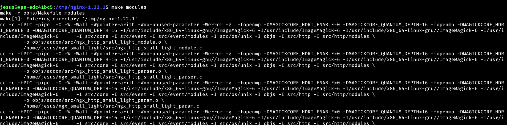

# UT3-TE1
# DPL - Jesus Sosa Morales - 2022

## Instalación y carga del módulo
Empezamos con la instalación de ngx_small_light,  es un módulo de transformación de imagen dinámica que esta disponible para nginx.

El módulo que vamos a instalar es un módulo de terceros para Nginx y lo vamos a cargar de forma dinámicamente.

Los módulos pueden requerir ciertos paquetes de soporte de cara a su compilación. En el caso de este módulo necesitamos las librerías de desarrollo de pcre entre otras:
```bash
sudo apt install -y build-essential imagemagick libpcre3 libpcre3-dev libmagickwand-dev
```


Una vez instaladas las librerias, vamos a  descargar el código fuente del módulo, para realizar esto tenemos que descargar el código fuente de Nginx con la misma versión que tenemos instalada en el sistema. Para ello:

```bash
curl -sL https://nginx.org/download/nginx-$(/sbin/nginx -v \
|& cut -d '/' -f2).tar.gz | tar xvz -C /tmp
```

Una vez realizado, tenemos que clonar el repositorio en git para tener una version en local y poder acceder al código fuente del módulo:

```bash
git clone https://github.com/cubicdaiya/ngx_small_light.git
```


Hay algunos módulos que requieren la generación de su configuración ejecutando ./setup y este es el caso de un modulo en el que tenemos que realizar esta acción, para ello nos dirigimos a la carpeta que hemos descargado y es donde se encuentra el código fuente.


Nos movemos a la carpeta donde hemos descargado el código fuente de Nginx y realizamos la configuración de la compilación:


A continuación generamos la librería dinámica:



Este proceso habrá creado un fichero .so dentro de la carpeta objs. Lo copiaremos a la carpeta desde la que se cargan los módulos dinámicos de Nginx:


Para que este módulo se cargue correctamente, hay que especificarlo en el fichero de configuración de Nginx:


```bash
user  nginx;
worker_processes  auto;

error_log  /var/log/nginx/error.log notice;
pid        /var/run/nginx.pid;

load_module /etc/nginx/modules/ngx_http_small_light_module.so;

events {
    worker_connections  1024;
}


http {
    include       /etc/nginx/mime.types;
    default_type  application/octet-stream;

    log_format  main  '$remote_addr - $remote_user [$time_local] "$request" '
                      '$status $body_bytes_sent "$http_referer" '
                      '"$http_user_agent" "$http_x_forwarded_for"';

    access_log  /var/log/nginx/access.log  main;

    sendfile        on;
    #tcp_nopush     on;

    keepalive_timeout  65;

    #gzip  on;

    include /etc/nginx/conf.d/*.conf;
}

```

Ahora ya podemos añadir las directivas del módulo a la configuración del virtual host. Para esto crearemos un virtual horst que apunte a /images.

## Creación del virtual host

Para crear un host virtual nos dirigimos a /etc/nginx/conf.d y creamos un nuevo archivo de configuracion para la ruta images.alu7174.arkania.es

```nginx
server {
        server_name images.alu7174.arkania.es;
        root /home/jesus/images;
       
        location  /img {
                small_light on;
		small_light_getparam_mode on;
        }
}
```

## Implementación de la aplicación
Para realizar la tarea inicialmente tenemos que descargarnos la imagenes de la actividad, para esto, nos dirigimos a https://github.com/sdelquin/dpl/tree/main/ut3/te1/files y descargamos la carpeta images.zip, una vez la tengamos descargada en la maquina virtual, movemos una copia de la descarga de la maquina virtual a nuestra maquina arkania:


Una vez copiada, instalamos unzip en la maquina de arkania y descomprimimos la carpeta.


Una vez tenemos las imagenes descomprimida, empezamos con la aplicación: 

Esta aplicación tiene que tener un formulario en el que le introducimos parametros y una vez pulsamos el boton de envio, el dominio de arkania que esta asociado con el módulo de ngx_small_light, tratara las imagenes y nos devolvera todas las imagenes con una serie de cambios que hemos seleccionado por los parametros, se propone un ejemplo:


#### Codigo HTML

Como podemos observar tambien hemos implementado las librerias de bootstrap.

```html
<!DOCTYPE html>
<html lang="en">
<head>
    <meta charset="UTF-8">
    <meta http-equiv="X-UA-Compatible" content="IE=edge">
    <meta name="viewport" content="width=device-width, initial-scale=1.0">
    <title>Document</title>
    <link href="https://cdn.jsdelivr.net/npm/bootstrap@5.1.3/dist/css/bootstrap.min.css" rel="stylesheet" integrity="sha384-1BmE4kWBq78iYhFldvKuhfTAU6auU8tT94WrHftjDbrCEXSU1oBoqyl2QvZ6jIW3" crossorigin="anonymous">
    <link rel="stylesheet" href="../style/estilos.css">

</head>
<body>


    <h1>Nginx +ngx_small_light</h1>
    <div class="container-fluid">
    <form action="" id="form">
        <div class="mb-3">  
            <label class="form-label" for="tamanio">Tamaño</label>
            <input  class="form-control" id="tamanio" name="tamanio" type="number">
        </div>
        <div class="mb-3">
            <label class="form-label" for="ancho">Ancho del borde</label>
            <input class="form-control" id="ancho" name="ancho" type="number">
        </div>
        <div class="mb-3">
            <label class="form-label" for="tamanio">Color del borde</label>
            <input class="form-control" id="color" name="color" type="color">
        </div>
        <div class="row">
            <div class="col-6">
                <div class="mb-3">
                    <label class="form-label" for="enfoque">Enfoque (radius)</label>
                    <input class="form-control" id="radius" name="radius" type="number">
                </div>
            </div>
            <div class="col-6">
                <div class="mb-3">
                    <label class="form-label" for="sigma">Enfoque (sigma)</label>
                    <input class="form-control" id="sigma" name="sigma" type="number">
                </div>

            </div>
        </div>


        <div class="row">
            <div class="col-6">

                <div class="mb-3">
                    <label class="form-label" for="desenfoque">Desenfoque (radius)</label>
                    <input class="form-control" id="blurradius" name="blurradius" type="number">
                </div>

            </div>
            <div class="col-6">

                <div class="mb-3">
                    <label class="form-label" for="sigma">Desenfoque (sigma)</label>
                    <input class="form-control" id="blursigma" name="blursigma" type="number">
                </div>

            </div>
        </div>
        
        
        
        
        <input class="btn btn-primary" type="submit" value="Ajustar">
        
    </form>
    </div>


    <div class="contenedor_img" id="imagenes">
    </div>
    <script src="form.js"></script>
</body>
</html>
```


#### Codigo Javascript 

```js
const form = document.getElementById('form');
        var divImagenes = document.getElementById('imagenes');
        var inputs = document.forms.form;

        form.addEventListener('submit', logSubmit);

        function logSubmit(event) {
            event.preventDefault();
            let texto="";
            for (let i = 1; i <= 20; i++) {
                texto += ""
                
            }
            console.log(texto);
            document.getElementById('imagenes').innerHTML = texto;
            
        }

        function getImgName(numero) {
            if (numero <10) {
                return "image0"+numero+".jpg";
            }
            return "image"+numero+".jpg";
        }
```

#### Codigo css

```css
form{
    display:flex;
    flex-direction: column;
    width: 300px;
}
.contenedor_img{
    display:flex;
    flex-wrap: wrap;
    justify-content: space-around;
    
}
img{
    margin: 10px;
}
```
#### Final de la app

Podemos ver el resultado final de la app, cuando abrimos inicialmente la aplicación:


Y acontinuación podemos ver el resultado de la ejecución:


Y si abrimos una imagen en otra pestaña :


Vemos que se ha redirigido a https.


## Certificado de seguridad

Let’s Encrypt es una entidad de certificación (CA) que proporciona una manera sencilla de obtener e instalar certificados de TLS/SSL gratuitos, lo que permite usar HTTPS cifrado en servidores web

El primer paso para utilizar Let’s Encrypt para obtener un certificado SSL es instalar el software Certbot en el servidor.


A continuación instalamos el plugin de certbot para nginx


Ahora ya podemos lanzar el cliente que nos permitirá obtener los certificados TLS y configurar el sitio web que queramos para que utilice protocolo https.

```nginx
jesus@vps-edc41bc5:~$ sudo certbot --nginx
Saving debug log to /var/log/letsencrypt/letsencrypt.log
Plugins selected: Authenticator nginx, Installer nginx
Enter email address (used for urgent renewal and security notices)
 (Enter 'c' to cancel): jesussosamorales@gmail.com

- - - - - - - - - - - - - - - - - - - - - - - - - - - - - - - - - - - - - - - -
Please read the Terms of Service at
https://letsencrypt.org/documents/LE-SA-v1.3-September-21-2022.pdf. You must
agree in order to register with the ACME server. Do you agree?
- - - - - - - - - - - - - - - - - - - - - - - - - - - - - - - - - - - - - - - -
(Y)es/(N)o: y

- - - - - - - - - - - - - - - - - - - - - - - - - - - - - - - - - - - - - - - -
Would you be willing, once your first certificate is successfully issued, to
share your email address with the Electronic Frontier Foundation, a founding
partner of the Let's Encrypt project and the non-profit organization that
develops Certbot? We'd like to send you email about our work encrypting the web,
EFF news, campaigns, and ways to support digital freedom.
- - - - - - - - - - - - - - - - - - - - - - - - - - - - - - - - - - - - - - - -
(Y)es/(N)o: n
Account registered.

Which names would you like to activate HTTPS for?
- - - - - - - - - - - - - - - - - - - - - - - - - - - - - - - - - - - - - - - -
1: images.alu7174.arkania.es
- - - - - - - - - - - - - - - - - - - - - - - - - - - - - - - - - - - - - - - -
Select the appropriate numbers separated by commas and/or spaces, or leave input
blank to select all options shown (Enter 'c' to cancel): 1
Requesting a certificate for images.alu7174.arkania.es
Performing the following challenges:
http-01 challenge for images.alu7174.arkania.es
Waiting for verification...
Cleaning up challenges
Deploying Certificate to VirtualHost /etc/nginx/conf.d/images.conf
Redirecting all traffic on port 80 to ssl in /etc/nginx/conf.d/images.conf

- - - - - - - - - - - - - - - - - - - - - - - - - - - - - - - - - - - - - - - -
Congratulations! You have successfully enabled https://images.alu7174.arkania.es
- - - - - - - - - - - - - - - - - - - - - - - - - - - - - - - - - - - - - - - -

IMPORTANT NOTES:
 - Congratulations! Your certificate and chain have been saved at:
   /etc/letsencrypt/live/images.alu7174.arkania.es/fullchain.pem
   Your key file has been saved at:
   /etc/letsencrypt/live/images.alu7174.arkania.es/privkey.pem
   Your certificate will expire on 2023-02-23. To obtain a new or
   tweaked version of this certificate in the future, simply run
   certbot again with the "certonly" option. To non-interactively
   renew *all* of your certificates, run "certbot renew"
 - If you like Certbot, please consider supporting our work by:

   Donating to ISRG / Let's Encrypt:   https://letsencrypt.org/donate
   Donating to EFF:                    https://eff.org/donate-le

```

El cliente certbot ha llevado a cabo el desafío http-01 para comprobar la veracidad del dominio. Este desafío consiste en poner un fichero en el servidor con un token y luego comprobar que se puede acceder desde la URL establecida por el dominio, verificando que el token es el esperado.

Ahora vamos a echar un vistazo a los cambios que ha sufrido el archivo de configuración del host virtual:


## Redirección www

Es muy habitual que la gente use el prefijo www al acceder a un sitio web. Es por ello que puede resultar útil configurar una redirección desde www.images.alu7174.arkania.es a images.alu7174.arkania.es

Lo primero será configurar la redirección de www en un virtual host aparte:


A continuación tenemos que lanzar certbot para el dominio  www.images.alu7174.arkania.es:


