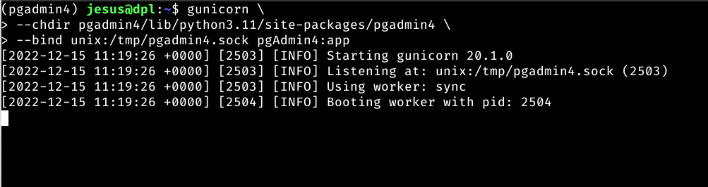
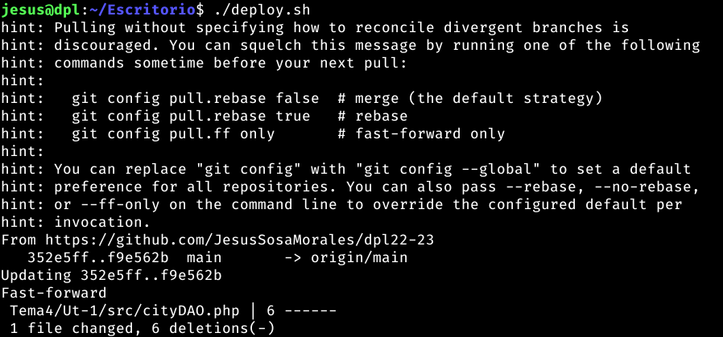

# UT4-TE1: Administración de servidores web (PostgreSQL)
## Jesus Sosa Morales

# ÍNDICE

- [Instalación de PostgreSQL + Carga de datos](#instalación-de-postgresql--carga-de-datos)
- [Instalación de pgAdmin + Registro de servidor](#instalación-de-pgadmin--registro-de-servidor)
- [Aplicación PHP en desarrollo](#aplicación-php-en-desarrollo)
- [Aplicación PHP en producción](#aplicación-php-en-producción)
- [Despliegue](#despliegue)


## Instalación de PostgreSQL + Carga de datos

Para la capa de datos de la aplicación que vamos a desplegar, necesitamos un sistema gestor de bases de datos. Trabajaremos sobre PostgreSQL, que es un sistema de gestión de bases de datos relacional orientado a objetos y de código abierto.

*Importante: La instalación de PostgreSQL la tenemos que hacer tanto en desarrollo como en producción por lo que  solo se muestran capturas de uno de ellos ya que el proceso es el mismo*

Lo primero será actualizar los repositorios:

```bash
sudo apt update
```


A continuación instalaremos algunos paquetes de soporte:

```bash
sudo apt install -y apt-transport-https
```


A continuación descargamos la clave de firma para el repositorio oficial de PostgreSQL y  añadimos el repositorio oficial de PostgreSQL al sistema:


Comando:

```bash
curl -fsSL https://www.postgresql.org/media/keys/ACCC4CF8.asc \
| sudo gpg --dearmor -o /etc/apt/trusted.gpg.d/postgresql.gpg
```

```bash
echo "deb http://apt.postgresql.org/pub/repos/apt/ $(lsb_release -cs)-pgdg main" \
| sudo tee /etc/apt/sources.list.d/postgresql.list > /dev/null
```

Resultado:


Ahora volvemos a actualizar la paquetería:

```bash
sudo apt update
```

Lo más probable es que dispongamos de distintas versiones de PostgreSQL. Con el siguiente comando podemos comprobarlo:

```bash
apt-cache search --names-only 'postgresql-[0-9]+$' | sort
```


Por tanto instalamos la última versión:

```bash
sudo apt install -y postgresql-15
```


Revisamos que la versión instalada sea la correcta:


```bash
psql --version
```

Tras la instalación, el servicio PostgreSQL se arrancará automáticamente. Podemos comprobarlo de la siguiente manera:

```bash
sudo systemctl status postgresql
```
El puerto por defecto en el que trabaja PostgreSQL es el 5432:

```bash
sudo netstat -napt | grep postgres | grep -v tcp6
```

Resultado de los comandos previos:


Base de datos

Vamos a crear una base de datos y un rol de acceso a la misma:

```bash
sudo -u postgres psql
```

A continuación accedemos al intérprete PostgreSQL con el nuevo usuario:

```bash
psql -h localhost -U travelroad_user travelroad
```


Ahora ya podemos crear la tabla de lugares:

```sql
CREATE TABLE places(
id SERIAL PRIMARY KEY,
name VARCHAR(255),
visited BOOLEAN);
CREATE TABLE
```

Obviamente empezamos con la tabla vacía:


```sql
SELECT * FROM places;
```


Vamos a cargar los datos desde este fichero places.csv a la tabla places.

Lo primero será descargar el fichero CSV:

```bash
curl -o /tmp/places.csv https://raw.githubusercontent.com/sdelquin/dpl/main/ut4/files/places.csv
```


A continuación usaremos la función copy de PostgreSQL para insertar los datos en la tabla:

```bash
psql -h localhost -U travelroad_user -d travelroad \
-c "\copy places(name, visited) FROM '/tmp/places.csv' DELIMITER ','"
```
Comprobamos que los datos se han insertado de manera adecuada:

```bash
psql -h localhost -U travelroad_user travelroad
```

```sql
SELECT * FROM places;
```
Resultado de los comandos previos:


Cuando ya tengamos los datos cargados, tenemos que configurar PostgreSQL para que pueda "escuchar" desde cualquier IP ya que por defecto solo permite conexiones desde localhost. Para esto debemos modificar una linea específica en el archivo.

```bash
sudo vi /etc/postgresql/15/main/postgresql.conf
```


Luego vamos a permitir el acceso del usuario anteriormente creado a la base de datos desde cualquier IP de origen. Para ello añadimos lo siguiente al final fichero de configuración.

```bash
sudo vi /etc/postgresql/15/main/pg_hba.conf
```


Tras realizar todas estas configuraciones, reiniciamos el servicio de PostgreSQL para que surtan efecto y comprobamos que ya esta escuchando todas las IPs.


```bash
sudo systemctl reload postgresql
```

El siguiente paso es crear la aplicación en desarrollo y un host virtual tanto en desarrollo como producción. En el caso de producción el nombre sera php.travelroad.alu7174.arkania.es y el de desarrollo php.travelroad.local.

Local:

Arkania:


## Instalación de pgAdmin + Registro de servidor

### pgAdmin

pgAdmin es la plataforma más popular de código abierto para administrar PostgreSQL. Tiene una potente interfaz gráfica que facilita todas las operaciones sobre el servidor de base de datos.

Es un software escrito en Python sobre un framework web denominado Flask.
Dependencias

### Instalación phyton
Lo primero de todo será instalar Python para poder realizar la implantación de esta herramienta.
Instalación


Lo primero será actualizar los repositorios:


Instalamos los prerrequisitos:


Descargamos la última versión disponible de Python:

```bash 
curl https://www.python.org/ftp/python/3.11.0/Python-3.11.0.tgz | tar xvz -C /tmp && cd /tmp/Python-3.11.0
```


Ejecutamos la instalación, respetando la versión por defecto de Python que hay en el sistema:

```bash
sudo make altinstall
```


Hacemos que esta nueva versión de Python sea la versión por defecto en el sistema:

```bash
sudo update-alternatives --install /usr/bin/python python /usr/local/bin/python3.11 10
```

Ahora podemos comprobar que la nueva versión quedó correctamente configurada:


Lo primero es asegurarnos de tener la última versión del instalador de paquetes:

```bash
python -m pip install -U pip
```
A  continuación instalamos los paquetes que necesitamos para desarrollo:
```bash
pip install black ipython wheel cowsay
```

### Instalación pgadmin
Creamos las carpetas de trabajo con los permisos adecuados:


Creamos un entorno virtual de Python (lo activamos) e instalamos el paquete pgadmin4:


Ahora lanzamos el script de configuración en el que tendremos que dar credenciales para una cuenta "master":


Esto nos lanzara un servidor de desarrollo en el puerto 5050, pero no nos interesa por el momento.

Para poder lanzar el servidor pgAdmin en modo producción y con garantías, necesitaremos hacer uso de un procesador de peticiones WSGI denominado gunicorn.

Podemos instalarlo como un paquete Python adicional (dentro del entorno virtual):


Ahora ya estamos en disposición de levantar el servidor pgAdmin utilizando:



Pero esto no es ideal tener el proceso gunicorn funcionando en una terminal, por lo que vamos a crear  un servicio del sistema. Para ello creamos el siguiente archivo pgadmin.service:


Recargamos todos los servicios e iniciamos el que acabamos de crear una vez vemos que esta activo, lo habilitamos en caso del reinicio del sistema.


Ahora creamos el host virtual pa pgadmin:


Recargamos los servicios de nginx y vamos a la URL, alli encontraremos un login con el que accederemos con las credenciales configurada:

Arkania:
Email: jesussmdpl@gmail.com
Contraseña: 123456

Local (email y contraseñas personales)


Registramos el servidor con el nombre de nuestra base de datos.


Y añadimos los datos de nuestra base de datos indicando host, puerto, el nombre de la base de datos y la contraseña.


Por último añadimos el certificado al virtual host:


## Aplicación PHP en desarrollo
La aplicación que se desarrollara en esta activida sera un programa desarrollado en php que se conectara con una base de datos en postgresql, la funcionalidad es muy simple simplemente haremos una consulta a sql a nuestra base de datos en la que nos devolvera un listado de lugares visitados y lugares que no hemos visitados, luego nos encargaremos de mostrar estas listas en un html.

Lo primero que vamos a hacer es clonar nuestro repositorio de git para poder trabajar con control de versiones en la maquina de desarrollo y en la de producción.


En nuestra aplicación de PHP debemos instalar el php8.2-pgsql para poder realizar la conexión con la base de datos por lo tanto lanzamos el siguiente comando:

```bash
sudo apt install -y php8.2-pgsql
```
El código de nuestra aplicación esta formado por 3 ficheros .php, como se muestra en la siguiente imagen:


- index.php
Este fichero mostrará la vista de nuestra aplicación a los usuarios que la visiten, este fichero lo unico que hace es realizar un require_once al fichero cityDAO, esta función incluye y evalua el fichero especificado durante la ejecución del script. Se comporta de manera similar a require(), con la única diferencia que si el código ha sido ya incluido, no se volverá a incluir.

A continuación se muestra el código completo.
```php
<?php
require_once("cityDAO.php");
?>
<!DOCTYPE html>
<html lang="en">
<head>
    <meta charset="UTF-8">
    <meta http-equiv="X-UA-Compatible" content="IE=edge">
    <meta name="viewport" content="width=device-width, initial-scale=1.0">
    <title>Document</title>
</head>
<body>
<h1>My Travel Bucket List</h1>
<h2>Places I'd Like to Visit</h2>
<ul>
    <?php
        $novisitadas = selectNoVisited();
    while($row=pg_fetch_row($novisitadas)){
        echo "<li> $row[1] </li>";
    }
    ?>
 
</ul>

<h2>Places I've Already Been To</h2>
<ul>
<?php
        $visitadas = selectVisited();
    while($row=pg_fetch_row($visitadas)){
        echo "<li> $row[1] </li>";
    }
    ?>
</ul>
</body>
</html>
```

- config.php
Este fichero lo unico que realiza es definir las credenciales de nuestra conexión a la base de datos. En este se establece, el Host, el nombre de la base de datos, el usuario y la contraseña.


A continuación se muestra el código completo.


```php
<?php
error_reporting(E_ALL);
ini_set('display_errors', '1');


if (!defined('__CONFIG__')) {
    define('__CONFIG__', true);
    define('__HOST', 'localhost');
    define('__DB', 'travelroad');
    define('__USER', 'travelroad_user');
    define('__PASS', 'dpl0000');
}
?>
```

- CityDAO.php
El acceso a datos se realiza mediante DAO (Data Access Object), con ello se obtiene un abstracción sobre el modelo de datos. Solo se accede a los datos a través de métodos definidos en el DAO, en este caso tenemos un DAO que se realiza una consulta select, en la que se seleccionan las ciudades visitadas y las no visitadas.

A continuación se muestra el código completo.

```php
<?php
error_reporting(E_ALL);
ini_set('display_errors', '1');

defined('__CONFIG__') || require_once ('config.php');

function abrirConex(){
    $host = __HOST;
    $db = __DB;
    $user = __USER;
    $pass = __PASS;
    return pg_connect("host=$host dbname=$db user=$user password=$pass");
}


function selectVisited(){
    $conexion = abrirConex();
    $ciudades = pg_exec($conexion, "SELECT * FROM places WHERE visited=true");

    pg_close($conexion);
    return $ciudades;

}

function selectNoVisited(){
    $conexion = abrirConex();
    $ciudades = pg_exec($conexion, "SELECT * FROM places WHERE visited=false");
    pg_close($conexion);
    return $ciudades;
}

?>
```


Para terminar crearemos un host virtual en el que especificaremos la ruta de nuestro fichero, el puertos un nombre y la configuracion de php.


*Importante: Destacar que despues de realizar la aplicación en desarrollo se ha subido los cambios al repositorio con git add . git commit -m "mensaje del commit" y finalmente un git push. No se adjuntan imagen de los comandos porque se entiende que es una tarea simple de subida de datos a git*

Finalmente comprobamos que funciona:


## Aplicación PHP en producción

Para traer la aplicación de entorno desarrollo a produccion, clonamos el repositorio.

La forma con la que suelo clonar repositorios git es la siguiente:

```git
git clone https ://${TOKEN}:x-oauth-basic@github.com/${USERNAME}/${REPO}.git
```

Donde sustituímos ${X} por lo que corresponda.


Para poder trabajar con seguridad y proteger nuestras credenciales hemos añadido un .gitignore que evita que traslademos el fichero config:


Este es el contenido:


Para que funcione la app php, tenemos que añadir un nuevo fichero config con nuestras credenciales en producción:


A continuación creamos un host virtual:


Una vez creado, podemos comprobar:


Ahora solo falta añadir la redireccion www y el protocolo https, para ello creamos un nuevo host virtual:


Este host virtual hará la redirección a nuestra página sin www.


Pero para que pueda redireccionar a nuestra página con protocolo https tenemos que añadirle el certificado tanto a nuestro host virtual como a la redirección www.


Ya nuestro host virtual y su redirección han obtenido su certificado por lo tanto ambas funcionan ya, con protocolo https.


## Despliegue

Para desplegar la aplicacion de desarrollo a produccion, realizaremos un script en el que nos conectaremos por ssh al entorno de producción para poder actualizar este entorno.


Ahora pongo al script con permisos para poder ejecutar.


Comprobamos que funciona




