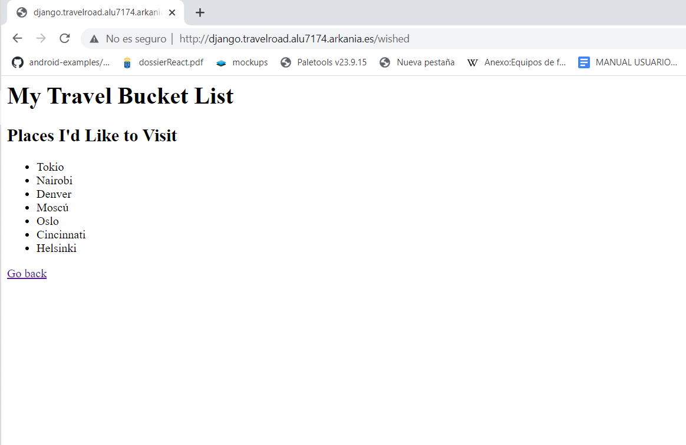

## Indice

- [Introduccion](#introduccion)
- [Instalación](#instalación)
- [Creación del proyecto](#creación-del-proyecto)
- [Probando la aplicación en desarrollo](#probando-la-aplicación-en-desarrollo)
- [Despliegue en producción](#despliegue-en-producción)
- [Especificación de requerimientos](#especificación-de-requerimientos)
- [Instalar las dependencias](#instalar-las-dependencias)
- [Parámetros para el entorno de producción](#parámetros-para-el-entorno-de-producción)
- [Servidor de aplicación](#servidor-de-aplicación)
- [Script de despliegue](#script-de-despliegue)
- [Resultado produccion](#resultado-produccion)
- [Enlace aplicación](#enlace-aplicación)
- [Conclusiones](#conclusiones)


## Introduccion

Django es un framework de desarrollo web de código abierto y de alto nivel basado en Python. Fue creado con el objetivo de simplificar el desarrollo web y ayudar a los desarrolladores a crear aplicaciones web robustas y escalables con rapidez y eficiencia.

Una de las características más destacadas de Django es su enfoque en el patrón de diseño Modelo-Vista-Controlador (MVC), lo que significa que los desarrolladores pueden separar claramente la lógica de la aplicación de la interfaz de usuario. Además, Django proporciona una amplia gama de herramientas y características que abarcan desde la gestión de bases de datos hasta la autenticación y seguridad de la aplicación.

Otro aspecto importante de Django es su enfoque en la escalabilidad y el rendimiento. Con Django, los desarrolladores pueden crear aplicaciones que se adapten fácilmente a una creciente cantidad de usuarios y datos, lo que permite una experiencia fluida y sin problemas para los usuarios finales.

Además, Django cuenta con una amplia comunidad de desarrolladores y una gran cantidad de documentación y recursos en línea, lo que significa que los desarrolladores pueden resolver fácilmente cualquier problema o desafío que puedan enfrentar mientras trabajan con el framework.

## Instalación
### Python

Lo primero de todo será instalar el lenguaje de programación y las herramientas Python para poder trabajar en el desarrollo de la aplicación web. 

En nuestro caso ya lo tenemos instalado de una tarea anterior.

### Entorno virtual

Habitualmente en Python trabajamos con entornos virtuales lo que nos permite aislar las dependencias de nuestro proyecto con respecto a otros proyectos o al sistema operativo.

Para crear (y activar) un entorno virtual ejecutamos lo siguiente:


Cuando activamos un entorno virtual el prompt se modifica y aparece entre paréntesis el nombre del entorno virtual.

Los nuevos paquetes que instalemos dentro del entorno virtual se almacenarán en la carpeta .venv:


La carpeta del entorno virtual .venv no debe estar en el control de versiones, por lo que se recomienda incluirla en el fichero .gitignore.

### Django

Para instalar Django (y sus dependencias) basta con utilizar la herramienta de gestión de paquetes en Python denominada pip (Package Installer for Python):


Podemos comprobar la versión instalada de Django con el siguiente comando:


## Creación del proyecto

Django proporciona la herramienta django-admin para crear la estructura base del proyecto:


Comprobamos el contenido de la carpeta de trabajo:


A diferencia de Ruby on Rails, Django sigue un patrón "minimalista" donde el andamiaje es modesto y con muy pocos ficheros iniciales.

Podemos lanzar el servidor de desarrollo con la herramienta manage.py que ya viene incluida en el andamiaje del proyecto:


Ahora si accedemos a http://localhost:8000 tendremos la pantalla de bienvenida de un proyecto base Django:


### Código de aplicación

Ahora ya estamos en disposición de empezar a montar las distintas partes de nuestra aplicación web. Django sigue el patrón MTV (Model-Template-View) que es análogo al modelo MVC. Funciona de la siguiente manera:

Un proyecto Django está formado por "aplicaciones". Lo primero será crear nuestra primera aplicación:


A través de este comando se ha creado una carpeta para alojar la aplicación places con el siguiente contenido:


Hemos de activar esta aplicación para que Django sea consciente de que existe. Para ello añadimos esta línea en el fichero main/settings.py:


### Acceso a la base de datos

Antes de nada debemos instalar un paquete de soporte denominado psycopg que viene a ser un driver para conectar Python con bases de datos PostgreSQL:


Hay que establecer las credenciales de acceso a la base de datos:


Dejar la sección DATABASES tal que así:


Django proporciona el subcomando check dentro de manage.py para comprobar que todo esté correcto:


### Modelos

En Django existe un ORM que permite mapear clases escritas en Python con entidades relacionales de la base de datos (PostgreSQL en este caso).


Vamos a escribir nuestro modelo de lugares:


Django añade automáticamente por defecto a todos sus modelos una clave primaria id que es única y autoincremental.

### Vistas

Creamos la vista que gestionará las peticiones a la página principal:


### Plantillas

A continuación creamos la plantilla:


### URLs

Es necesario vincular cada URL con la vista que la gestionará.

Para ello, lo primero es crear el fichero de URLs para la "aplicación" places:


Y ahora enlazamos estas URLs desde el fichero principal:


## Probando la aplicación en desarrollo

Con todo esto ya estamos en disposición de probar nuestra aplicación en un entorno de desarrollo (local):


Si accedemos a http://localhost:8000 podemos observar el resultado esperado:


## Despliegue en producción

Queremos que las credenciales a la base de datos sea un elemento configurable en función del entorno en el que estemos trabajando.

Esto lo podemos conseguir (entre otros) mediante un paquete de Python denominado prettyconf que sirve para cargar variables de entorno mediate un fichero de configuración.

Realizamos la instalación del paquete (ojo tener activo el entorno virtual Python):


Modificamos las siguientes líneas del fichero settings.py para aprovechar las funcionalidades de este paquete:


Ahora creamos un fichero .env que contendrá las configuraciones concretas para el entorno de producción:


## Especificación de requerimientos

De cara a que el proyecto pueda "reproducirse" en cualquier entorno virtual necesitamos especificar los requerimientos (dependencias) en un fichero requirements.txt.

Lo creamos y añadimos los paquetes utilizados:


## Instalar las dependencias
Una vez clonado el repositorio y con el entorno virtual creado y activo, ejecutamos el siguiente comando para instalar las dependencias del proyecto:


## Parámetros para el entorno de producción
Necesitamos un fichero .env que contendrá las configuraciones concretas para el entorno de producción:

## Servidor de aplicación

Existen múltiples alternativas para el despliegue de una aplicación Django y un amplio abanico de servidores de aplicación.

En este caso vamos a elegir gunicorn como servidor WSGI (Web Server Gateway Interface) para Python.
gunicorn

La instalación de gunicorn es muy sencilla ya que se trata de un paquete del ecosistema Python:


Una vez instalado, tenemos a nuestro alcance un script de gestión que permite lanzar el servidor:


### Supervisor

Dado que el servidor WSGI debemos mantenerlo activo y con la posibilidad de gestionarlo (arrancar, parar, etc.) hemos de buscar alguna herramienta que nos ofrezca estas posibilidades.

Una alternativa es usar servicios systemd, como hemos visto anteriormente (Java Spring).

Pero en esta ocasión vamos a usar Supervisor que es un sistema cliente/servidor que permite monitorizar y controlar procesos en sistemas Linux/UNIX... ¡Y además está escrito en Python!

Para instalarlo ejecutamos el siguiente comando:


Podemos comprobar que el servicio está levantado y funcionando:


Supervisor viene con la herramienta supervisorctl, pero inicialmente un usuario "ordinario" no tiene permisos para usarla:


Para que un usuario no privilegiado pueda usar el servicio, la estrategia a seguir es añadir un grupo supervisor con permisos para ello, y luego unir al usuario a dicho grupo.

Y Editamos la configuración de Supervisor:


Reiniciamos el servicio para que surtan efectos los cambios realizados:


Ahora añadimos el usuario al grupo creado:


Salimos de la sesion para que los cambios se efectuen

Una vez de vuelta en la sesión podemos comprobar que ya no se produce ningún error al lanzar el controlador de supervisor con nuestro usuario habitual:


### Script de servicio

Aunque no es totalmente obligatorio, sí puede ser de utilidad que tengamos un script de servicio para nuestra aplicación que se encargue de levantar gunicorn:


Damos permisos de ejecución:


### Configuración Supervisor

Lo que nos queda es crear la configuración de un proceso supervisor que lance nuestro servicio WSGI como servidor de aplicación para la aplicación Django.


Ahora ya podemos añadir este proceso: (Se me olvido sacar captura)

```bash
supervisorctl reread
supervisorctl add travelroad
supervisorctl status
```


### Nginx
Por último nos queda configurar el virtual host para derivar las peticiones al servidor WSGI:


Inicialmente si hacemos un:

```bash
sudo nginx -t
```
Nos dara error en el include del proxy_params, esto lo arreglamos creando un nuevo fichero dentro de la configuracion de nginx.


Recargamos la configuración de Nginx para que los cambios surtan efecto.

## Script de despliegue
Veamos un ejemplo de script de despliegue para esta aplicación:


Damos permisos de ejecución:


## Resultado produccion
### Resultado sin certificado





### Resultado con certificado
Añadimos el certificado


## Enlace aplicación

https://django.travelroad.alu7174.arkania.es/

## Conclusiones

La opinion final de Django nos ha dejado con cosas positivas y que nos ha gustado y otros temas que no nos ha gustado, en cuanto a lo positivo, es un framework que es fácil de aprender, Django tiene una curva de aprendizaje suave y es fácil de entender, incluso para los desarrolladores con poca experiencia en Python.

Posee una documentación completa y soporte activo, Django cuenta con una amplia documentación y una comunidad muy activa que brinda soporte y soluciones a los desarrolladores.

La seguridad es sólida, Django está diseñado para ser seguro y cuenta con una serie de características integradas para proteger contra ataques comunes, como inyecciones SQL y cross-site scripting (XSS).

La Escalabilidad, Django es un framework escalable que se puede utilizar para proyectos pequeños y grandes por igual.

Integración con bases de datos, Django ofrece una integración fácil con bases de datos y permite a los desarrolladores trabajar con una amplia gama de bases de datos, incluyendo SQLite, PostgreSQL y MySQL.


Y los aspectos negativos son: Rendimiento: Aunque Django es un framework escalable, puede ser más lento que otros frameworks en ciertos casos, especialmente cuando se trabaja con grandes conjuntos de datos.


En resumen, Django es un framework de desarrollo web potente y versátil que ofrece una gran cantidad de herramientas y características para ayudar a los desarrolladores a crear aplicaciones web robustas, escalables y eficientes en poco tiempo, pero le falta un poco de rendimiento respecto a otros frameworks visto en clases.


