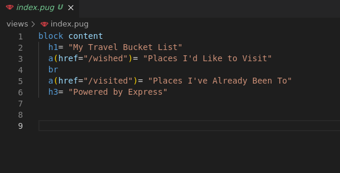

## Indice

- [Introduccion](#introduccion)
- [Instalación](#instalación)
- [Aplicación](#aplicación)
- [Configuración de la Base de Datos](#configuración-de-la-base-de-datos)
- [Lógica Negocio](#lógica-de-negocio)
- [Gestionando procesos](#gestionando-procesos)
- [Configuración de Nginx](#configuración-de-nginx)
- [Resultado en desarrollo](#resultado-en-desarrollo)
- [Despliegue](#despliegue)
- [Produccion](#produccion)
- [Enlace aplicación](#enlace-aplicacion)
- [Conclusiones](#conclusiones)

## Introduccion

Express es un framework minimalista de aplicaciones web para Node.js. Fue creado en 2010 por TJ Holowaychuk y desde entonces se ha convertido en uno de los frameworks de Node.js más populares y ampliamente utilizados.

Express ofrece una plataforma sencilla y flexible para el desarrollo de aplicaciones web

## Instalación

### Node.js
Node.js es una plataforma de desarrollo de código abierto basada en JavaScript que se ejecuta en el lado del servidor. Fue creada en 2009 por Ryan Dahl y desde entonces se ha convertido en una de las plataformas más populares para el desarrollo de aplicaciones web y de red.

Node.js permite a los desarrolladores escribir aplicaciones web y de red utilizando JavaScript en el lado del servidor, lo que significa que pueden utilizar un mismo lenguaje para el front-end y el back-end de sus aplicaciones. Esto facilita el desarrollo y aumenta la eficiencia.

Además, Node.js cuenta con una amplia comunidad de desarrolladores y una gran cantidad de paquetes y librerías disponibles en su plataforma de paquetes npm (Node Package Manager), lo que facilita la implementación de funcionalidades y mejora la productividad de los desarrolladores.

En resumen, Node.js es una plataforma de desarrollo altamente versátil y eficiente que permite a los desarrolladores crear aplicaciones web y de red de manera rápida y sencilla. Con su amplia comunidad y su gran cantidad de herramientas y librerías disponibles, Node.js es una excelente opción para cualquier proyecto de desarrollo web o de red.

Existe un instalador que nos facilita añadir los repositorios oficiales de Node.js. El comando a ejecutar es el siguiente:

Ahora ya podemos instalar Node.js de forma ordinaria:

Comprobamos las versiones de Node.js y de npm (sistema de gestión de paquetes para Node.js):

## Aplicación

Ahora ya podemos crear la estructura (andamiaje) de nuestra aplicación Express. Para ello utilizamos express-generator una herramienta que debemos instalar de forma global en el sistema:

Creamos la estructura base de la aplicación indicando que las vistas (plantillas) van a utilizar pug como motor de plantillas:

El comando anterior creará una carpeta travelroad con la estructura base para poder desarrollar nuestra aplicación web:

Tal y como indica la salida del comando, ahora debemos instalar las dependencias:

npm install obtiene las dependencias del fichero package.json y almacena los paquetes en la carpeta node_modules.

Ahora podemos probar la aplicación lanzando el servidor de desarrollo:

Para poder acceder a la base de datos PostgreSQL necesitamos una dependencia adicional node-postgres. Realizamos la instalación:

En este fichero hay que guardar la cadena de conexión a la base de datos PostgreSQL:

## Configuración de la base de datos

Para poder acceder a la base de datos PostgreSQL necesitamos una dependencia adicional node-postgres. Realizamos la instalación:

Siempre es interesante guardar las credenciales en un fichero "externo". En este caso vamos a trabajar con un fichero .env con lo que necesitaremos el paquete dotenv. Lo instalamos:

En este fichero hay que guardar la cadena de conexión a la base de datos PostgreSQL:

## Lógica de negocio

Nos queda modificar el comportamiento de la aplicación para cargar los datos y mostrarlos en una plantilla.

Nuestro proyecto tendra el siguiente aspecto:

Conexión a la base de datos, lo realizaremos dentro de un fichero .js llamado database el cual encontraremos en la carpeta config.

La gestión de las rutas la haremos con el fichero index.js.

Para la plantilla para la vista usaremos un fichero pug para cada vista.

Y comprobamos que la dirección http://localhost:3000 nos da el resultado que esperábamos:

## Gestionando procesos

Vamos a hacer uso de pm2 un gestor de procesos para aplicaciones Node.js en producción.

Lo primero es instalar el paquete de forma global en el sistema:

Ahora ya podemos lanzar un proceso en background con nuestra aplicación. Estando en la carpeta de trabajo ~/travelroad ejecutamos el siguiente comando:

## Configuración de Nginx

Lo único que nos queda es preparar el virtual host en Nginx para comunicar con el proceso de Node.js:

## Resultado en Desarrollo

## Despliegue

Veamos un ejemplo de script de despliegue para esta aplicación:

## Produccion

### Nginx

### Resultado sin certificado

### Resultado con certificado

## Enlace aplicacion

https://express.travelroad.alu7174.arkania.es/

## Conclusiones

La opinion final de Express es, que la escalabilidad es muy  limitada, Express es un framework minimalista, lo que significa que no ofrece todas las características y herramientas necesarias para desarrollar aplicaciones a gran escala.

Esto hace que tenga una mayor dificultad para el desarrollo de aplicaciones complejas, debido a su enfoque en la simplicidad, Express puede no ser la mejor opción para desarrollar aplicaciones muy complejas con un gran número de funcionalidades.

Ademas falta de seguridad integrada, Express no proporciona muchas medidas de seguridad integradas, lo que significa que los desarrolladores deben implementar ellos mismos medidas de seguridad adicionales para proteger sus aplicaciones.

Y otro problema es que tiene una falta de documentación clara y completa,  lo que puede dificultar la implementación de ciertas funcionalidades, a esto sumarle que el motor de plantillas empleado no es muy intuitivo.