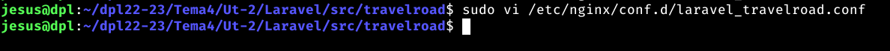
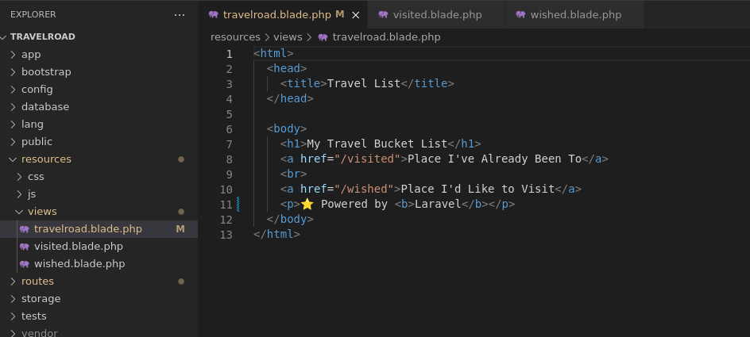

## Indice

- [Introduccion](#introduccion)
- [Instalacion](#instalacion)
- [Aplicacion](#aplicacion)
- [Configuración Nginx](#configuración-nginx)
- [Logica Negocio](#lógica-de-negocio)
- [Resultado en desarrollo](#resultado-en-desarrollo)
- [Despliegue](#despliegue)
- [Produccion](#produccion)
- [Enlace aplicación](#enlace-aplicacion)
- [Conclusiones](#conclusiones)

## Introduccion

Laravel es un framework de desarrollo web de código abierto basado en PHP. Fue creado en 2011 por Taylor Otwell y desde entonces se ha convertido en uno de los frameworks más populares y utilizados en todo el mundo.

Laravel ofrece una amplia gama de características y herramientas que facilitan y agilizan el desarrollo de aplicaciones web. Entre ellas se incluyen un sistema de ruteo avanzado, un motor de plantillas Blade, un sistema de autenticación y autorización, integración con bases de datos, entre otras.

Además, Laravel cuenta con una gran comunidad de desarrolladores y una documentación detallada y completa, lo que facilita a los desarrolladores aprender y utilizar el framework de manera eficiente.

Laravel también destaca por su enfoque en la calidad del código y en la seguridad de las aplicaciones. Incluye características de seguridad integradas como la protección contra ataques de inyección SQL y la encriptación de contraseñas, lo que garantiza la seguridad de los datos y la privacidad de los usuarios.

## Instalación

### Composer

Composer es un gestor de paquetes para PHP. Se utiliza para administrar las dependencias de un proyecto de software, es decir, las bibliotecas o componentes externos que un proyecto necesita para funcionar correctamente. Con Composer, los desarrolladores pueden descargar, actualizar y gestionar estas dependencias de manera fácil y eficiente.

Además, Composer permite que los desarrolladores compartan y reutilicen código de manera sencilla, lo que ahorra tiempo y esfuerzo en el desarrollo de software. También facilita la gestión de versiones y la solución de problemas relacionados con las dependencias, lo que garantiza la estabilidad y la compatibilidad del proyecto.

En resumen, Composer es una herramienta esencial para cualquier proyecto de desarrollo en PHP que utiliza dependencias externas. Con su ayuda, los desarrolladores pueden ahorrar tiempo y esfuerzo en la gestión de dependencias y centrarse en el desarrollo de la aplicación.

Vamos a instalar Composer:

Comprobamos la versión instalada:

Paquetes de soporte

Necesitamos ciertos módulos PHP habilitados en el sistema. Para ello instalamos los siguientes paquetes soporte:

### Paquetes:

- mbstring: Gestión de cadenas de caracteres multibyte
- xml: Análisis XML
- bcmath: Operaciones matemáticas de precisión arbitraria
- curl: Cliente de cURL
- pgsql: Herramientas para PostgreSQL

## Aplicacion 

Ahora ya podemos crear la estructura de nuestra aplicación Laravel. Para ello utilizamos composer indicando el paquete laravel/laravel junto al nombre de la aplicación:

Podemos ver que se muestra una seri de instalaciones para crear nuestro proyecto, esto se debe a que laravel es un framework que añade un gran cantidad de contenido por defecto a la hora de crar un proyecto nuevo.

Como curiosidad tambien se muestra el final de la salida, donde podemos ver que nos imprime informacion de que todo ha salido correcto

Vemos que se ha creado una carpeta travelroad con el andamio (scaffolding) para empezar a trabajar:

Entramos en la carpeta de trabajo y probamos que se ha instalado correctamente artisan, la interfaz en línea de comandos para Laravel:

Por defecto se ha creado un fichero de configuración .env durante el andamiaje. Abrimos este fichero y modificamos ciertos valores para especificar credenciales de acceso:

## Configuración Nginx

Lo primero será fijar los permisos adecuados a los ficheros del proyecto para que los servicios Nginx+PHP-FPM puedan trabajar sin errores de acceso.

Existen un par de carpetas en las que se puede almacenar información. Ajustamos los permisos:

La configuración del virtual host Nginx para nuestra aplicación Laravel la vamos a hacer en un fichero específico:

Comprobamos la sintaxis del fichero y, si todo ha ido bien, recargamos la configuración Nginx:

Editamos el fichero /etc/hosts

Si ahora abrimos el navegador en http://laravel.travelroad veremos una página de inicio (launching) con información general sobre el framework:

## Lógica de negocio

Nos queda modificar el comportamiento de la aplicación para cargar los datos y mostrarlos en una plantilla.

Lo primero es cambiar el código de la ruta:

Dentro de la carpeta ruta encontramos el web.php.

Lo segundo es escribir la plantilla que renderiza los datos. Renderizar una plantilla significa sustituir las variables por sus valores y así obtener un HTML final. Utilizaremos Blade como motor de plantillas incluido en Laravel.

Las plantillas las podemos encontrar dentro de la carpeta views que esta dentro de la carpeta resources, como podemos ver en la imagen.

Para esta aplicación utilizaremos 3 plantillas.

Plantilla del home, esta sera lo primero que se carge al entrar en el sitio web.

Plantilla para ciudades visitadas.

Plantilla para ciudades que le gustaria visitar.

## Resultado en desarrollo

Ya podemos abrir el navegador en http://laravel.travelroad y comprobar que todo está funcionando correctamente:

## Despliegue

Creamos el fichero .env 

## Produccion

### NGINX

Instalamos certificado de seguridad

### Resultado final sin seguridad

### Resultado final con seguridad

## Enlace aplicacion

https://laravel.travelroad.alu7174.arkania.es/

## Conclusiones

La opinion final del framework Laravel es que es una excelente opción para los desarrolladores que buscan un framework robusto, fácil de usar y con una gran comunidad detrás. Con su enfoque en la calidad del código, la seguridad y la eficiencia, Laravel es una herramienta indispensable para cualquier proyecto de desarrollo web.

Al principio puede parecer un framework complejo debido a la gran cantidad de archivos que se generan a la hora de crear un nuevo proyecto, pero la curva de aprendizaje hace que sea mas facil de utilizar y de dominar cuando tienes dominadas los ficheros importantes como son las rutas, los controladores y las plantillas.