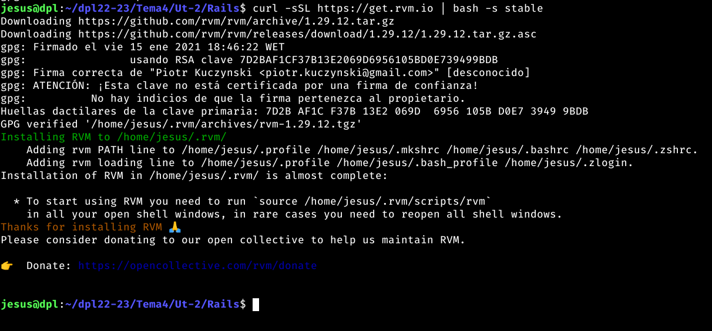

## Indice

- [Introduccion](#introduccion)
- [Instalación](#instalación)
- [Aplicación](#creando-la-aplicación)
- [Lógica de negocio](#lógica-de-negocio)
- [Configuración Nginx](#configuración-nginx)
- [Host virtual](#host-virtual)
- [Despliegue](#probando-el-despliegue)
- [Entorno Produccion](#entorno-produccion)
- [Enlace aplicación](#enlace-aplicación)
- [Conclusiones](#conclusiones)

## Introduccion

Ruby on Rails, también conocido como Rails, es un framework de desarrollo web de código abierto basado en Ruby. Fue lanzado en 2005 y desde entonces se ha convertido en uno de los frameworks de desarrollo web más populares y ampliamente utilizados en todo el mundo.

Rails se enfoca en la productividad y la simplicidad, y proporciona una estructura de desarrollo clara y organizada para facilitar el desarrollo de aplicaciones web. Con Rails, los desarrolladores pueden crear aplicaciones web rápidamente y con una menor cantidad de código en comparación con otros frameworks similares.

Rails también ofrece una gran cantidad de características y herramientas para mejorar la calidad de las aplicaciones, incluyendo la gestión de bases de datos, el enrutamiento de peticiones, la gestión de seguridad y la integración de terceros.

Además, Rails cuenta con una amplia comunidad de desarrolladores y una gran cantidad de paquetes y librerías disponibles, lo que facilita la implementación de funcionalidades y mejora la productividad de los desarrolladores.

## Instalación

### RVM

RVM es el acrónimo de Ruby Version Manager. Es una herramienta de línea de comandos que permite a los desarrolladores instalar y gestionar múltiples versiones de Ruby en un mismo sistema.

RVM es útil para aquellos desarrolladores que trabajan en múltiples proyectos que pueden requerir versiones diferentes de Ruby. Con RVM, los desarrolladores pueden instalar y cambiar fácilmente entre diferentes versiones de Ruby sin afectar otros proyectos o aplicaciones en el sistema.

Además, RVM también permite a los desarrolladores gestionar múltiples entornos de desarrollo y aislarlos entre sí, lo que ayuda a mantener una consistencia y organización en el desarrollo de aplicaciones Ruby.

En resumen, RVM es una herramienta valiosa para cualquier desarrollador de Ruby que trabaje en múltiples proyectos y requiera una gestión eficiente y organizada de las diferentes versiones de Ruby.

Añadimos las claves GPG:

Ahora lanzamos el script de instalación:

Abrimos una nueva pestaña para que los cambios se reflejen y podamos probar RVM:

### Ruby

Ahora procedemos a instalar Ruby usando RVM:

Tenemos que establecer la versión por defecto de Ruby que vamos a utilizar:

Comprobamos tanto la versión de Ruby como la versión de la herramienta gem que se utiliza para instalar paquetes (gemas):

### Ruby on Rails

Estamos ya en disposición de instalar Ruby on Rails:

Comprobamos ahora la versión instalada de Ruby on Rails:

### Requisitos de sistema

Necesitamos instalar algún paquete en el sistema para dar soporte a los pasos posteriores. En este caso nos hace falta libpq una librería de sistema para acceso a bases de datos PostgreSQL:

## Creando la aplicación

Rails nos provee de un subcomando para crear una nueva aplicación (andamiaje). Incluimos el nombre de la aplicación y el tipo de base de datos que vamos a utilizar:

La estructura de carpetas y ficheros queda tal que así:

Para que la conexión a la base de datos funcione correctamente debemos establecer las credenciales de inicio de sesión en PostgreSQL. Para ello utilizamos uno de los ficheros que provee Ruby on Rails en su andamiaje:

Ruby on Rails trae incorporado el servidor de aplicación Puma que lo podemos lanzar en modo "desarrollo" para comprobar que todo esté funcionando correctamente:

Si abrimos un navegador en http://localhost:3000 obtendremos una pantalla similar a la siguiente:

## Lógica de negocio

### Rutas

Lo primero es editar el fichero de rutas y modificarlo convenientemente:

### Modelo

Para crear el código base del modelo utilizamos la herramienta que nos proporciona Ruby on Rails:

En la salida del comando anterior podemos ver un fichero de migraciones en la carpeta migrate. Las migraciones incluyen los cambios a aplicar en la base de datos cuando creamos o modificamos cualquier modelo (de datos).

### Controlador

Para crear el código base del controlador utilizamos la herramienta que nos proporciona Ruby on Rails:

Editamos el controlador:

### Vista

Para la vista vamos a utilizar ERB un motor de plantillas sencillo pero potente para Ruby.

Editamos el fichero de la vista:

### Migraciones

Dado que estamos trabajando con una base de datos y una tabla ya creadas, no nos interesa aplicar las migraciones que nos sugiere Ruby on Rails. Para no obtener un error, deshabilitamos esa opción en otro fichero de configuración del entorno de desarrollo:

### Probando la aplicación

Ahora ya estamos en disposición de levantar el servidor de desarrollo y comprobar que todo funciona correctamente:

## Configuración Nginx

### Passenger

Para poder conectar Nginx con Ruby on Rails necesitamos hacer uso del módulo Passenger.

Passenger es un servidor web de aplicaciones que se utiliza para desplegar y gestionar aplicaciones web de Ruby, Python, Node.js y otros lenguajes de programación.

Passenger se enfoca en la simplicidad y la facilidad de uso, y proporciona una solución eficiente y escalable para el despliegue y gestión de aplicaciones web. Con Passenger, los desarrolladores pueden concentrarse en el desarrollo de aplicaciones, mientras que Passenger se encarga de la gestión de la infraestructura y la escalabilidad de la aplicación.

Antes de nada debemos intalar la herramienta en sí:

Comprobamos la versión instalada:

Aunque la documentación oficial se enfoca más en compilar un "nuevo" Nginx incluyendo el módulo passenger de forma estática, en nuestro caso vamos a incluirlo de forma dinámica al Nginx "existente".

Lo primero será instalar las dependencias que tiene este módulo de cara al proceso de compilación:

A continuación descargamos el código fuente de Nginx con la misma versión que el Nginx que tenemos funcionando en el sistema:

Nos movemos a la carpeta descargada:

Realizamos la configuración:

Y construimos el módulo dinámico:

Como resultado de este proceso obtendremos un fichero ngx_http_passenger_module.so que copiaremos a la carpeta desde la que se cargan los módulos en Nginx:

Ya por último, para cargar el módulo en Nginx, tocamos la configuración del servicio, añadiendo la siguiente línea a /etc/nginx/nginx.conf:

También es necesario incluir en el fichero anterior, la ruta raíz de passenger. La podemos encontrar con el comando:

Añadimos ahora esta ruta al fichero /etc/nginx/nginx.conf dentro del bloque http { ... } y antes de la línea include /etc/nginx/conf.d/*.conf;:

Comprobamos que la sintaxis sea correcta y reiniciamos el servidor web:

## Host virtual
Creamos un nuevo fichero de configuración para dar servicio a este escenario:

## Probando el despliegue
Es el momento de generar los assets de la aplicación (CSS, Javascript, ...):

Tras todos estos cambios, nos aseguramos de reiniciar (mejor que recargar por la cantidad de modificaciones/módulos que hemos tocado) el servidor web Nginx.

Y finalmente accedemos a http://ror.travelroad comprobando que es el resultado esperado:

Script de despliegue
Veamos un ejemplo de script de despliegue para esta aplicación:

Damos permisos de ejecución:

## Entorno Produccion

No se ha podido realizar, ya que da errores, por falta de memoria en la maquina de arkania.

Se ha realizado en desarrollo incluyendo los pasos de produccion como hemos visto antes.

## Enlace aplicación
No se ha podido desplegar en arkania, solo en local.
## Conclusiones

En resumen, Ruby on Rails es un framework de desarrollo web popular y eficiente que ofrece una estructura de desarrollo clara y organizada, una gran cantidad de características y herramientas para mejorar la calidad de las aplicaciones y una amplia comunidad de desarrolladores y paquetes disponibles. Con su enfoque en la productividad y la simplicidad, Rails es una excelente opción para cualquier proyecto de desarrollo web.

Lo unico negativo es no haber podido desplegar a produccion por la falta de memoria, pero aun así es un framework que es bastante sencillo.