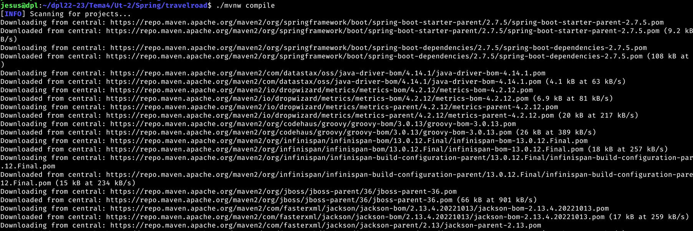
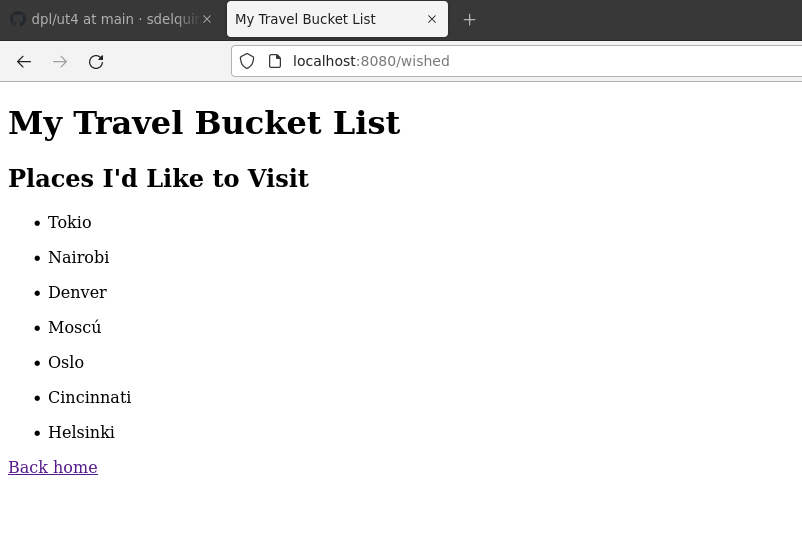
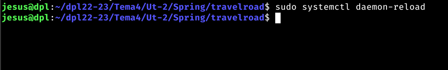

## Indice

- [Introduccion](#introduccion)
- [Instalación](#instalación)
- [Aplicación](#aplicacion)
- [Escritura de código](#escritura-de-código)
- [Proceso de construcción](#proceso-de-construcción)
- [Entorno de producción](#entorno-de-producción)
- [Script de despliegue](#script-de-despliegue)
- [Resultados](#resultados)
- [Enlace aplicación](#enlace-aplicacion)
- [Conclusiones](#conclusiones)

## Introduccion

Spring es uno de los frameworks más populares y ampliamente utilizados para el desarrollo de aplicaciones Java. Fue creado en 2003 por Rod Johnson y desde entonces ha evolucionado para convertirse en una de las plataformas de desarrollo más completas y maduras disponibles.

Spring es un framework de inversión de control (IoC) y un framework de arquitectura de aplicaciones, lo que significa que proporciona una estructura de desarrollo y una serie de herramientas para ayudar a los desarrolladores a crear aplicaciones más eficientes y escalables.

Además, Spring ofrece una gran cantidad de características y herramientas para mejorar la seguridad, el rendimiento y la eficiencia de las aplicaciones, incluyendo la gestión de dependencias, el enrutamiento de peticiones, la integración de bases de datos, la seguridad de aplicaciones y la gestión de transacciones.

Otro aspecto destacado de Spring es su amplia comunidad de desarrolladores y su gran cantidad de paquetes y librerías disponibles, lo que facilita la implementación de funcionalidades y mejora la productividad de los desarrolladores.

## Instalación

### JDK

Lo primero será instalar el Java Development Kit (JDK). Existe una versión "opensource" denominada OpenJDK.

Descargamos el paquete OpenJDK desde su página de descargas:

Ahora descomprimimos el contenido del paquete en /usr/lib/jvm:

Tener en cuenta que la última versión disponible puede variar en el tiempo.

Comprobamos que todo ha ido bien y que el contenido del paquete está disponible:

Necesitamos realizar alguna configuración adicional para que el JDK funcione correctamente.

Por un lado establecer variables de entorno adecuadas a la instalación. Básicamente indicar dónde se encuentran los ejecutables de Java modificando la variable de entorno PATH:

Contenido:

Por otro lado actualizar las alternativas para los ejecutables:

Por lo tanto disponemos de:
- javac → es el compilador del lenguaje de programación Java.
- java → es la herramienta para ejecutar programas escritos en Java.

Ahora ya podemos comprobar las versiones de las herramientas instaladas:

En este punto se debe cerrar la sesión y volver a abrirla para que los cambios se apliquen correctamente.

### SDKMAN

SDKMAN es una herramienta que permite gestionar versiones de kits de desarrollo de software (entre ellos Java).

Para su instalación debemos comprobar que tenemos el paquete zip instalado en el sistema:

Ahora ejecutamos el siguiente script de instalación:

A continuación activamos el punto de entrada de la siguiente manera:

Ya deberíamos de tener la instalación completada. Comprobamos la versión de la herramienta:

### Spring Boot

Dentro de Spring, existe un subproyecto denominado Spring Boot que facilita la preparación de aplicaciones Spring para ponerlas en producción. Utilizaremos esta herramienta durante el despliegue.

Para instalarla hacemos uso de SDKMAN:

Comprobamos la versión instalada:

### Maven

Maven es una herramienta enfocada a la construcción de proyectos Java que permite la gestión de dependencias. Su instalación también es a través de SDKMAN:

Comprobamos la versión instalada:

Existen otras herramientas para construcción de proyectos Java. Aquí podemos citar Gradle.

## Aplicacion
### Creación del proyecto

Creamos la estructura base del proyecto utilizando Spring Boot con el siguiente comando:

Listamos el contenido de la carpeta de trabajo:

## Escritura de código

Tendremos que adaptar un poco la estructura inicial del proyecto para cumplir con el objetivo de la aplicación que tenemos que desarrollar.

Dentro de la carpeta src/main tendremos que organizar los distintos módulos (controlador, modelo y plantilla) que componen la aplicación de la siguiente manera:

### Controlador

### Modelo

### Repositorio

### Plantilla

Para la plantilla vamos a utilizar Thymeleaf un motor de plantillas moderno para Java:

### Dependencias

Maven es un gestor de dependencias. Por tanto debemos definir estas dependencias en un fichero XML:

Listado de dependencias 

spring-boot-starter-web 	Andamiaje de la aplicación web.
spring-boot-starter-test 	Andamiaje de tests para la aplicación web.
spring-boot-starter-thymeleaf 	Motor de plantillas.
spring-boot-starter-data-jpa 	Capa de persistencia Java.
postgresql 	Driver para conectar a bases de datos PostgreSQL (JDBC).
spring-boot-maven-plugin 	Plugin de Spring Boot para usar Maven.

### Credenciales
El fichero que contiene las credenciales se añadira al .gitignore

## Proceso de construcción

Para poner en funcionamiento el proyecto necesitamos dos fases que se llevarán a cabo mediante Maven:

    Compilación.
    Empaquetado.

La herramienta que usamos para ello es Maven, pero en el propio andamiaje de la aplicación ya se incluye un Maven Wrapper denominado mvnw que incluye todo lo necesario para poder construir el proyecto.

Para llevar a cabo la compilación del proyecto ejecutamos lo siguiente:

Inicio

Final

Para llevar a cabo el empaquetado del proyecto ejecutamos lo siguiente:
Inicio

Final

Tras esto, obtendremos un archivo JAR (Java ARchive) en la ruta:

El fichero generado tiene la versión 0.0.1-SNAPSHOT. Esto se puede cambiar modificando la etiqueta <version> del fichero pom.xml.

Una forma de lanzar la aplicación es correr el fichero JAR generado:

Dentro del empaquetado también se incluye Tomcat un servidor de aplicaciones para Java que se puede usar perfectamente en producción.

Esto nos permitirá acceder a http://localhost:8080 y comprobar que la aplicación funciona correctamente.

Tener en cuenta que la carpeta target no debe estar dentro de control de versiones.

## Entorno de producción

De cara a simplificar el proceso de despliegue en el entorno de producción, podemos disponer de un script que realice los pasos del proceso de construcción:

Asignamos permisos de ejecución:

A continuación creamos un fichero de servicio para gestionarlo mediante systemd:

Añadimos este servicio para que esté disponible:

Iniciamos el servicio y lo habilitamos para que se inicie en el arranque del sistema:

Podemos comprobar el estado del servicio (tener en cuenta que puede tardar algún tiempo):

### Configuración de Nginx

Lo último que nos queda es configurar el host virtual en Nginx para dar servicio a las peticiones:

Recargamos la configuración del servidor web para que los cambios surtan efecto:

## Script de despliegue

Veamos un ejemplo de script de despliegue para esta aplicación:

Damos permisos de ejecución:

## Resultados
Antes de añadir certificado de seguridad:

Despues de añadir el certificado de seguirdad:

## Enlace aplicacion

https://spring.travelroad.alu7174.arkania.es/

## Conclusiones

La conclusion final de Spring es que es un framework de desarrollo Java completo y maduro que ofrece una gran cantidad de herramientas y características para ayudar a los desarrolladores a crear aplicaciones más eficientes, escalables y seguras. Con su amplia comunidad y su gran cantidad de paquetes y librerías disponibles, Spring es una excelente opción para cualquier proyecto de desarrollo Java.
